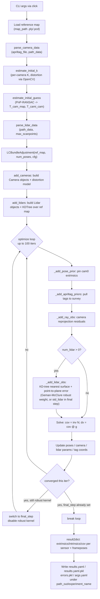

# `lcba.py` — Process Documentation

Companion documentation for `scripts/lcba.py`, its runtime context in
`compose.yaml`, and the input/output data it produces. All statements below
are grounded in the source of `scripts/lcba.py` and
`src/ipb_calibration/{ipb_preprocessing.py,lc_bundle_adjustment.py,camera.py,lidar.py,apriltag.py}`.

## 1. Executive Overview

### Core Purpose

`lcba.py` runs an offline **LiDAR-Camera Bundle Adjustment (LCBA)**: a joint,
photogrammetric/point-cloud least-squares optimization that simultaneously
estimates:

- The **extrinsic pose** of every camera and every LiDAR relative to a common
  reference (`cam0`).
- The **intrinsic** camera parameters (focal length, principal point,
  distortion coefficients) and, optionally, per-LiDAR **range bias/scale**.
- The 3D **positions of AprilTag corners** (refined around a surveyed prior).
- The **pose of the sensor rig at every recorded timestamp**, relative to a
  static, high-precision reference point cloud ("Faro" terrestrial laser
  scan).

### Problem Domain

This is a multi-sensor **extrinsic + intrinsic self-calibration** problem for
a mobile sensor rig (multiple cameras + multiple LiDARs) that observed:

1. A set of **AprilTag fiducial markers** with known (surveyed) 3D
   coordinates, seen by the cameras — giving classical camera
   resection/bundle-adjustment constraints (2D reprojection error).
2. A static **reference point cloud** ("Faro" scan of the room) that the
   LiDAR scans are registered against using a point-to-plane distance to the
   nearest reference surface, robustified with a Geman-McClure kernel.

The optimizer is a **Gauss-Newton / weighted-least-squares** solver built by
hand (normal equations `N`, `g`, `dx = N⁻¹g`) rather than a library like
`scipy.optimize` or `g2o`; parameter blocks and Jacobians are managed
explicitly (`lc_bundle_adjustment.py:103-527`).

## 2. Docker & Execution Context

### Runtime Environment

- **Image build** (`Dockerfile`): Ubuntu 20.04 base, installs `open3d`
  system deps, builds the AprilTag C library (`AprilRobotics/apriltag` v3.4.2)
  from source, then `pip install -e .` installs this repo's `ipb_calibration`
  package (`pyproject.toml`) together with its Python dependencies.
- **Entrypoint** (`Dockerfile:70-72`, `entrypoint.bash`): the container's
  `CMD` runs `/root/entrypoint.bash`, which invokes:
  ```bash
  python3 calib/scripts/lcba.py \
      --map-path reference/reference_pointcloud.ply \
      --apriltag_file reference/apriltag_coords.txt \
      --path_data input \
      --path_out output \
      --experiment_name result1 | tee output/result1.log
  ```
  stdout/stderr are teed to `output/result1.log`.
- **Compose service** (`compose.yaml:3-24`, service `systemcalib`): builds
  the image from the repo root (`build: .`), runs with the default (empty)
  Compose profile so it starts on a plain `docker compose up`. As of the
  headless rework in §12, this service needs **no X11 socket, `DISPLAY`,
  or NVIDIA GPU** — `--visualize` now writes alignment-evidence `.pcd`
  files into `path_out` instead of opening an interactive OpenGL window,
  so the whole run is CPU-only.

  (The sibling service `apriltag_extraction` is a separate tool —
  `scripts/extract_all_apriltag_coords_on_scan.py` — used only to *generate*
  `reference/apriltag_coords.txt` from a TLS scan; it is not part of the
  `lcba.py` invocation and only runs under the `apriltag_extraction` Compose
  profile.)

### Configuration & Parameters

**Volumes** mounted into the `systemcalib` container (`compose.yaml:7-15`):

| Host path | Container path | Mode | Purpose |
|---|---|---|---|
| `$PWD/input` | `/root/input` | read-only | Recorded per-camera images and per-LiDAR scans, plus `calibration.yaml` |
| `$PWD/reference` | `/root/reference` | read-only | Reference point cloud (`.ply`, or a directory of `.pcd` scans to concatenate) and AprilTag ground-truth coordinates (`.txt` or `.csv`) |
| `$PWD/output` | `/root/output` | read-write | Calibration results, logs, and (with `--visualize`) alignment-evidence `.pcd` files |

No X11 socket or `DISPLAY` forwarding is needed for `systemcalib` — see §12.

**CLI arguments** of `lcba.py` (defined via `click`, `lcba.py:24-38`):

| Option | Short | Type / default | Meaning |
|---|---|---|---|
| `--apriltag_file` | `-a` | `str` | `.txt` or `.csv` file with AprilTag ID + 3D coordinates (see §3). Ignored for an Isaac Sim capture directory (ground truth comes from its `gt/apriltag_*.csv` files instead) |
| `--path_data` | `-p` | `str` | Directory with `calibration.yaml` and the per-topic image/scan folders — or an Isaac Sim capture directory (`config.yaml` + `camera/`/`lidar/`/`gt/`), auto-detected |
| `--map-path` | `-m` | `str` | Reference point cloud: a single `.ply`/`.pcd` file, or a directory of `.pcd` scans concatenated into one map (the "Faro" TLS scan, renamed from `--faro_file`) |
| `--path_out` | `-o` | `str` | Output root directory |
| `--std_pix` | `-sp` | `float`, `0.2` | Assumed std. dev. of AprilTag corner detection in pixels — weights the reprojection error term |
| `--std_apriltags` | `-sa` | `float`, `0.002` | Assumed std. dev. (m) of the surveyed AprilTag corner coordinates — weights the AprilTag prior term |
| `--std_lidar` | `-sl` | `float`, `0.01` | Assumed std. dev. (m) of LiDAR points to the reference surface — used only in the final (non-robust) iteration |
| `--max_scanpoints` | `-mp` | `int`, `2500` | Max points kept per LiDAR scan after random downsampling; `-1` = keep all |
| `--bias` / `--no-bias` | — | `bool`, `False` | Estimate a per-LiDAR range bias |
| `--scale` / `--no-scale` | — | `bool`, `False` | Estimate a per-LiDAR range scale |
| `--division_model` / `--no-division_model` | — | `bool`, `False` | Use the division distortion model instead of the Brown (polynomial) model |
| `--dist_degree` | — | `int`, `3` | Polynomial degree of the non-linear distortion model |
| `--experiment_name` | `-e` | `str`, `"dev"` | Subfolder name under `path_out`, so repeated runs don't overwrite each other |
| `--visualize` / `--no-visualize` | — | `bool`, `False` | Write alignment-evidence `.pcd` files before/after optimization (see §12); headless, no display required |

No environment variables are read by `lcba.py` itself.

## 3. Input File Specifications

### 3.1 `--apriltag_file` — AprilTag ground-truth coordinates (`.txt` or `.csv`)

- **Identifier**: `Apriltags.__init__` (`apriltag.py`) branches on the file
  extension:
  - `.txt`: plain-text, whitespace-delimited, e.g.
    `reference/apriltag_coords.txt`. Parsed via
    `np.loadtxt(file, skiprows=1).reshape(-1, 4, 4)` (schema below).
  - `.csv`: a reference-style table with a header row and columns `tag_id`,
    `top_left_x_3d`, `top_left_y_3d`, `top_left_z_3d`,
    `top_right_x_3d`/`y`/`z`, `bottom_right_x_3d`/`y`/`z`,
    `bottom_left_x_3d`/`y`/`z` (`Apriltags._load_csv`) — the same 3D-corner
    column names/order as the Isaac `gt/apriltag_<frame_id>.csv` format
    (§below), minus the per-frame/camera columns that don't apply to a
    static survey table. Both formats are reordered internally to the same
    corner convention and produce numerically identical
    `apriltag_coords`/`apriltag_ids` — `reference/apriltag_coords.csv` here
    is a verified 1:1 conversion of `reference/apriltag_coords.txt`.
- **`.txt` schema**:
  - Line 1: a single integer header (total row count — read but not used
    for parsing logic since `skiprows=1` just skips it).
  - Every subsequent group of **4 consecutive rows** describes one AprilTag's
    4 corners. Each row is 4 whitespace-separated numbers:
    `<encoded_id> <x> <y> <z>` (mandatory, all numeric).
  - `encoded_id` is `tag_id*100 + corner_index` (0-3); the code recovers the
    tag id via `apriltag_ids = (apriltags[:, 0, 0] / 100).astype(int)`
    (`apriltag.py:22`) — i.e. only the *first* row of each 4-row group is
    used to derive the tag id, the other 3 rows' first column is ignored for
    id purposes.
  - `x, y, z` are the corner's 3D coordinates in the reference/map frame
    (meters), mandatory.
- **Purpose**: gives the fixed "ground-truth" 3D positions used both to (a)
  build the AprilTag detector's corner ↔ 3D correspondence table and (b)
  form a Gaussian prior (`--std_apriltags`) that keeps the optimized tag
  coordinates close to the survey, `_add_apriltag_priors`
  (`lc_bundle_adjustment.py:399-406`).
- **Example** (2 corners of one tag, id `82`):
  ```
  476
  8201 -2.87457 -1.37728  0.22523
  8202 -2.87306 -1.21290  0.22585
  8203 -2.87362 -1.37762  0.06118
  8204 -2.87271 -1.21236  0.06152
  ```

### 3.2 `--map-path` — reference point cloud (`.ply`/`.pcd`, or a directory of `.pcd`)

- **Identifier**: `pp.load_reference_map(map_path)` (`ipb_preprocessing.py`,
  called from `main()`): a directory concatenates every `.pcd` inside it
  into one cloud; anything else (typically
  `reference/reference_pointcloud.ply`) is read directly via
  `o3d.io.read_point_cloud`.
- **Schema**: standard PLY/PCD point cloud (XYZ, optionally normals/colors — if
  normals are absent they are estimated on the fly,
  `lc_bundle_adjustment.py:240-242`).
- **Purpose**: the static, high-accuracy "world" surface that LiDAR scans
  are matched against (point-to-plane distance via a `scipy.spatial.KDTree`
  nearest-neighbor lookup, `_add_lidar_obs`, `lc_bundle_adjustment.py:351-397`).
- No textual example possible (binary/ASCII PLY geometry file).

### 3.3 `--path_data` directory

Must contain:

#### 3.3.1 `calibration.yaml`

- **Identifier**: YAML, at `<path_data>/calibration.yaml`. Parsed twice:
  once in `parse_camera_data` and once in `parse_lidar_data`
  (`ipb_preprocessing.py:263`, `ipb_preprocessing.py:137`).
- **Schema**:

  | Key | Type | Mandatory | Meaning |
  |---|---|---|---|
  | `image_topics` | list[str] | yes | One entry per camera; also used as the subfolder name (`/` stripped) holding that camera's `.png` frames |
  | `point_cloud_topics` | list[str] | yes | One entry per LiDAR; subfolder name (`/` stripped) holding that LiDAR's `.pcd` scans |
  | `init_cami_to_cam0.<topic>` | list[6 floats] | optional (defaults to identity if key/`init_cami_to_cam0` absent, `ipb_preprocessing.py:289`) | `[rx, ry, rz]` (deg, XYZ Euler) + `[tx, ty, tz]` (m) initial guess of camera-`i`-to-`cam0` extrinsics |
  | `init_lidari_to_cam0.<topic>` | list[6 floats] | yes | Same format; initial guess of LiDAR-to-`cam0` extrinsics |
  | `camera_models` | list[str], `"pinhole"`/`"fisheye"` | optional (defaults to all `"pinhole"` with a printed warning, `ipb_preprocessing.py:323-335`) | Per-camera lens model, selects OpenCV's `calibrateCamera` vs. `fisheye.calibrate` for the initial intrinsics guess |
  | `out_dir` | str | unused by `lcba.py` (present in sample file, read elsewhere in the package) | — |

- **Purpose**: central manifest tying topic names to folders and providing
  initial-guess extrinsics that seed the bundle adjustment.
- **Example**:
  ```yaml
  image_topics:
    - /camera/front/image_raw
  point_cloud_topics:
    - /lidar/horizontal/points
  init_cami_to_cam0:
    camerafrontimage_raw: [0, 0, 0, 0, 0, 0]
  init_lidari_to_cam0:
    lidarhorizontalpoints: [0, -90, 90, 0, -0.35, -0.6]
  camera_models: [pinhole]
  ```

#### 3.3.2 Per-camera image folders (`<path_data>/<topic_no_slashes>/*.png`)

- **Identifier**: `.png` images, filenames sorted lexically
  (`sorted(glob.glob(f'{folder}/*.png'))`, `ipb_preprocessing.py:278-279`)
  and treated as a **time-synchronized sequence index `t`** shared across
  cameras and LiDARs — i.e. file `0000.png` in every camera folder and
  `0000.pcd` in every LiDAR folder must correspond to the same real-world
  timestamp / rig pose.
- **Schema**: any image `plt.imread` can load; converted to grayscale via
  channel-mean (`ipb_preprocessing.py:284`) before AprilTag detection.
- **Purpose**: raw frames the AprilTag detector runs on to produce 2D
  corner ↔ tag-id observations per camera per timestamp.

#### 3.3.3 Per-LiDAR scan folders (`<path_data>/<topic_no_slashes>/*.pcd`)

- **Identifier**: `.pcd` point cloud files, one per timestamp, same
  sorted-index convention as images. Loaded via `load_scan`
  (`ipb_preprocessing.py:116-120`), a thin wrapper around
  `o3d.io.read_point_cloud`.
- **Schema**: any Open3D-readable `.pcd` (ASCII or binary). Only the `x`,
  `y`, `z` fields are consumed — Open3D loads those into `cloud.points`;
  any additional fields the file may carry (e.g. `intensity`, `t`,
  `reflectivity`, `ring`, `ambient`, `range` — as produced by
  `scripts/npy2pcd.py` from raw Ouster `.npy` scans) are simply not read
  into the point cloud and are **not required** by the calibration (see
  note below).
- **Purpose**: a single LiDAR scan (point cloud) in the sensor's own frame,
  at timestamp `t`; randomly downsampled to at most `--max_scanpoints`
  points before use.

> **Which LiDAR point fields does the calibration actually need?**
> Only `x`, `y`, `z`. A repo-wide search of `lc_bundle_adjustment.py` and
> `lidar.py` (the only two modules that consume LiDAR scan data) shows every
> operation — `scan2world`, `apply_intrinsics`, the nearest-surface KD-tree
> query, the point-to-plane error and its Jacobians — indexes only the
> `[:, :3]` XYZ coordinates of each point (`lidar.py:100-155`,
> `lc_bundle_adjustment.py:351-397`). `intensity`, `t`, `reflectivity`,
> `ring`, `ambient`, and `range` (present in the raw Ouster `.npy` scans)
> are never referenced anywhere in the calibration pipeline. Converting
> `.npy` → `.pcd` therefore only strictly needs to preserve XYZ; keeping the
> extra fields in the `.pcd` (as `scripts/npy2pcd.py` does, for
> archival/traceability) is harmless but has no effect on calibration
> results.

### 3.4 Output directory (`--path_out`)

Not an input, but must be writable; the container mounts it read-write
(`compose.yaml:13`).

## 4. Step-by-Step Execution Walkthrough

Trace of `main()` in `scripts/lcba.py:39-114`:

1. **`config = locals()`** (`lcba.py:53`) — snapshots every CLI argument for
   later provenance logging (`args.yaml`).
2. **Load reference point cloud**:
   `pcd_map = pp.load_reference_map(map_path)`.
3. **Parse camera data** (`lcba.py:58-59`,
   `ipb_preprocessing.parse_camera_data`, `ipb_preprocessing.py:261-337`):
   - Builds an `Apriltags` detector from `apriltag_file`.
   - Loads `calibration.yaml`, iterates `image_topics`; for each camera,
     globs and sorts its `.png` frames, runs `Apriltags.detect` on each
     grayscale frame, and records image size.
   - Detections across all cameras/frames populate `seen_tags` — a
     dict `tag_id → 3D coords` used to build a `tag → row index` lookup
     table (`tag2indx`) so every detected corner can be matched back to its
     surveyed 3D coordinate (`coords`).
   - Builds `imgpixel[c][t]` (2D corner pixel arrays) and `indices[c][t]`
     (row indices into `coords`) per camera/timestamp.
   - Determines `cam_is_pinhole` per camera from `calibration.yaml`'s
     `camera_models` (default: all pinhole, with a warning if the counts
     don't add up).
   - Returns `imgpixel, indices, coords, observations, T_cami_cam_yaml,
     img_sizes, cam_is_pinhole`.
4. **Initial intrinsics guess** (`lcba.py:61-67`,
   `estimate_initial_k`, `ipb_preprocessing.py:367-423`):
   - For each camera, for up to `max_num_images=10` frames with the most
     planar (`find_plane`, `ipb_preprocessing.py:344-364`) tag observations,
     runs OpenCV's `cv2.calibrateCamera` (pinhole) or
     `cv2.fisheye.calibrate` (fisheye, with skew/K1-K4 fixed to zero) to get
     an initial camera matrix and distortion coefficients.
   - `find_plane` fits a local 2D basis through 3 of a tag's 4 corners and
     keeps only tags whose out-of-plane residual is below `max_z_dist=0.1`
     m — filters out tags seen at an oblique/degenerate angle.
   - Builds `init_K` (`3×3` matrices) from the returned `[cx, cy, fx, fy]`
     vectors (`lcba.py:63-65`).
5. **Initial camera pose guess** (`lcba.py:69-70`,
   `estimate_initial_guess`, `ipb_preprocessing.py:223-258`):
   - Uses `cv2.solvePnPRansac` (`est_pose_from_obs`,
     `ipb_preprocessing.py:199-220`) on the timestamp with the most shared
     tag observations between `cam0` and camera `i` to get an initial
     `T_cami_cam0` per non-reference camera.
   - Then, per timestamp, picks the camera with the most tag observations
     and solves its `T_cam2map` via PnP, propagates it to `cam0`'s pose at
     that timestamp using the just-estimated `T_cami_cam0`. Produces
     `T_cam_map` (per-timestamp `cam0`-to-map pose) and `T_cami_cam`
     (per-camera extrinsics relative to `cam0`).
6. **Initial LiDAR guess** (`lcba.py:73`, `parse_lidar_data`,
   `ipb_preprocessing.py:127-164`):
   - Re-reads `calibration.yaml`; for each LiDAR topic, globs `.pcd` scans,
     random-downsamples each to `≤ max_scanpoints` points
     (`scan.random_down_sample(ratio)`), and builds the initial
     LiDAR-to-`cam0` transform from `init_lidari_to_cam0` (Euler XYZ degrees
     + translation).
7. **Construct the optimizer** (`lcba.py:76-79`,
   `LCBundleAdjustment.__init__`, `lc_bundle_adjustment.py:104-124`):
   - Stores `ref_map`, `cfg` (the `calibration.yaml` dict — used later to
     name output keys by topic), `num_poses = len(T_cam_map)`, and
     `outlier_mult=3` (multiplies the robust/final thresholds for LiDAR
     correspondence rejection).
8. **`add_cameras`** (`lcba.py:80-91`, `lc_bundle_adjustment.py:126-173`):
   - Stores per-camera-per-timestamp pixel observations, tag index
     mapping, and tag coordinates (kept as `coords_prior` for the prior
     term).
   - Instantiates one `camera.Camera` per camera with its `K`, extrinsics,
     pinhole/fisheye flag, and a `camera.CVDistortionModel` (Brown polynomial
     of `dist_degree`, or division model if `--division_model`), seeded
     from OpenCV's `init_coeff`.
9. **`add_lidars`** (`lcba.py:93-98`, `lc_bundle_adjustment.py:216-253`):
   - Converts each `Open3D` scan to a plain `np.array` (`self.points`).
   - Builds a `scipy.spatial.KDTree` over the reference map points
     (`self.map_kdtree`) for nearest-surface lookups, estimating normals on
     the map if missing.
   - Instantiates one `lidar.Lidar` per topic with its extrinsics and a
     `lidar.LinearLidarIntrinsics` that optionally estimates bias/scale
     (`--bias`/`--scale`).
10. **`optimize(num_iter=100, visualize=visualize)`**
    (`lc_bundle_adjustment.py:476-527`) — the core Gauss-Newton loop, up to
    `100` iterations:
    - Optional pre-optimization visualization.
    - Each iteration builds the normal equations `N` (Hessian approx.) and
      `g` (negative gradient) over all parameters (`self.num_params` =
      `6·num_poses + Σ camera_params + Σ lidar_params + 3·num_tags`):
      - `_add_pose_prior` (`:336-349`): heavily weighted (`1e6`) prior
        pinning camera-0's extrinsics to identity — fixes the otherwise
        unobservable global rotation/translation of the extrinsic block.
      - `_add_apriltag_priors` (`:399-406`): Gaussian prior pulling
        optimized tag corners toward `coords_prior`, weighted by
        `1/std_apriltags²`.
      - `_add_ray_obs` (`:282-334`): for every camera/timestamp/detected
        corner, computes the reprojection error `camera.project(...) -
        p_img`, its Jacobian w.r.t. pose/camera-intrinsics/tag-coords, and
        accumulates weighted by `1/std_pix²`. Also updates `self.ray_mad`
        (a robust residual scale, unused downstream in this file) and
        prints `sigma0` (a posteriori standard deviation) and outlier %
        (though `num_invalids` is never incremented, so this always prints
        `0.00%`).
      - `_add_lidar_obs` (`:351-397`, only if `num_lidar > 0`): for each
        LiDAR scan/timestamp, transforms points to world (applying
        intrinsics + extrinsics + pose), finds the nearest reference point
        via KD-tree, computes the **point-to-plane** error (`normal · (p -
        p_ref)`). Correspondences farther than `threshold` are rejected
        (`threshold = std_lidar·outlier_mult` in the final step, else
        `GM_k_lidar·outlier_mult` during robustified iterations). Weight is
        `1/std_lidar²` in the final step, or a **Geman-McClure** robust
        weight `GM_k²/(GM_k²+error²)²` otherwise — this is the mechanism
        that down-weights LiDAR outliers during early iterations.
    - **Solve**: `cov = inv(N)`, `dx = cov @ g` — a direct dense linear
      solve (no Levenberg-Marquardt damping).
    - **Update**: splits `dx` into pose (`d_w`), camera (`d_c`), LiDAR
      (`d_l`), and tag-coordinate (`d_p`) blocks and applies each additive
      update (`_update_poses`, `_update_camera_extrinsics`,
      `_update_lidar_extrinsics`, direct `+=` for tag coords).
    - **Convergence check** (`:508-522`): `self.converged` is set `True` at
      the start of the iteration and AND-ed with `|dr|<1e-5` rad and
      `|dt|<1e-5` m for every pose/camera/LiDAR update. Once converged
      *while still using the robust (Geman-McClure) kernel*, the loop
      switches `final_step = True` (disabling the robust kernel and
      re-enabling the tighter, non-robust `std_lidar` threshold) and
      continues; it only actually `break`s once converged **with**
      `final_step` already `True` — i.e. convergence is checked twice: once
      to leave the robust regime, once to stop.
    - Returns `(self.result2dict(cov), self.errors)` — see §6 for the
      exact structure.
11. **Persist results** (`lcba.py:103-114`):
    - `path_out = <path_out>/<experiment_name>`, created if missing
      (`mkdir(exist_ok=True, parents=True)`).
    - `results.yaml.pkl` — raw `pickle.dump(results)` (preserves numpy
      arrays exactly).
    - `results.yaml` — same `results` dict passed through `convert_dict`
      (`lcba.py:13-21`, recursively converts every `np.ndarray` leaf to a
      nested Python list) then `yaml.safe_dump`.
    - `errors.pkl` — `pickle.dump(errors)`, the per-camera/per-LiDAR raw
      residual vectors from the **last** optimization iteration.
    - `args.yaml` — `yaml.safe_dump(config)`, i.e. every CLI argument value
      (this is how the `args.yaml` example in §2 was produced).

No explicit `try/except` error handling exists anywhere in this path;
failures (missing files, PnP failure via `assert valid` in
`est_pose_from_obs`, singular `N` matrix in `optimize`, etc.) propagate as
uncaught Python exceptions and a non-zero process exit code.

## 5. Calibration Process Flowchart



## 6. Output Artifacts & Side Effects

All outputs are written under `<path_out>/<experiment_name>/`
(created with `mkdir(parents=True, exist_ok=True)`):

| File | Format | Content |
|---|---|---|
| `results.yaml` | YAML (numpy arrays → nested lists via `convert_dict`) | Human-readable calibration result, see schema below |
| `results.yaml.pkl` | pickle | Same `results` dict, but with native `numpy` arrays preserved (exact re-load for downstream Python tooling) |
| `errors.pkl` | pickle | `self.errors`: `dict[str, list[np.ndarray]]` — per-sensor (`cam_<i>` / `lidar_<i>`), per-timestamp residual vectors **from the final optimizer iteration only** (each camera entry is `[num_rays·2, 1]` reprojection error; each LiDAR entry is `[num_valid_points, 1]` point-to-plane error) |
| `args.yaml` | YAML | Every CLI argument and its value (full run provenance) |
| `summary.yaml` | YAML | Quantitative run summary — see §12.2 |
| `lidar_alignment_initial.pcd` / `lidar_alignment_final.pcd` (only with `--visualize`) | binary PCD | Reference map + every transformed LiDAR scan, colored by timestamp, merged into one point cloud — visual evidence of the LiDAR-to-map alignment before/after optimization; see §12.1 |
| `output/result1.log` (via `entrypoint.bash`, outside `path_out`) | text | Full stdout of the run (`tee`), including per-iteration `sigma0`, pose/camera/LiDAR update magnitudes, and convergence messages |

### `results.yaml` / `results.yaml.pkl` schema (`result2dict`, `lc_bundle_adjustment.py:453-474`)

Top-level keys, one per camera topic and one per LiDAR topic (folder name
with `/` stripped, taken from `cfg["image_topics"]` /
`cfg["point_cloud_topics"]`), plus a `frameposes` key:

```yaml
camerafrontimage_raw:        # one block per camera (Camera.get_param_dict)
  K: [[fx, 0, cx], [0, fy, cy], [0, 0, 1]]
  extrinsics: [[4x4 T_cam_i_to_cam0]]
  distortion_coeff: [...]     # OpenCV-format coefficients (CVDistortionModel.to_cv2)
  is_pinhole: true
  cov: [[...]]                 # covariance sub-block of this camera's own parameters
lidarhorizontalpoints:        # one block per LiDAR (Lidar.get_param_dict)
  extrinsics: [[4x4 T_lidar_to_cam0]]
  intrinsics: [bias, scale]   # only the enabled subset (LinearLidarIntrinsics.params)
  cov: [[...]]
frameposes:
  poses: [[4x4 T_cam0_to_map per timestamp]]    # length = num_poses
  cov: [[6x6 pose covariance per timestamp]]
```

- `cov` blocks are extracted from the full `inv(N)` covariance matrix of the
  last iteration, sliced to each parameter group's index range
  (`param_idx`, `lc_bundle_adjustment.py:196-214`).
- The optimized AprilTag corner coordinates themselves (`self.apriltag_coords`,
  updated in-place each iteration) are **not** included in `results2dict`'s
  output — only implicitly reflected through the reprojection residuals in
  `errors.pkl`.

### Process exit code

Standard Python/`click` behavior: exit code `0` on normal completion after
writing all four files; a non-zero exit code (uncaught exception traceback
on stderr) on any failure (missing/malformed input files, PnP failure,
singular normal-equation matrix, etc.) — there is no custom exit-code
handling in `lcba.py`.

## 7. FAQ: Why does the reference data need so many AprilTags, and does LiDAR alignment use anything besides geometry?

`reference/apriltag_coords.txt` in this repo surveys **119 distinct
AprilTags** (476 rows = 119 tags × 4 corners,
`Apriltags.__init__`/`apriltag.py:14-26`). This section traces why that many
tags are needed, and clarifies that the tags and the FARO scan serve two
completely independent roles in the optimization.

### 7.1 The FARO `.ply` and the AprilTag file are never cross-referenced

- `reference_pointcloud.ply` is consumed **only** by `_add_lidar_obs`
  (`lc_bundle_adjustment.py:351-397`): a `scipy.spatial.KDTree` is built once
  over `ref_map.points`, each transformed LiDAR point is matched to its
  nearest neighbor in that cloud, and the residual is a **point-to-plane
  distance** — `normal · (point − nearest_ref_point)` — using the map's
  (estimated, if absent) surface normals. Nothing here reads
  `apriltag_coords`, `intensity`, `reflectivity`, or any other non-XYZ
  field. So, confirming the observation from §3.3.3: **LiDAR-to-map
  registration is pure geometric ICP-style matching**, nothing else.
- `apriltag_coords.txt` is consumed **only** by the camera path
  (`parse_camera_data` → `_add_ray_obs`, `ipb_preprocessing.py:261-337`,
  `lc_bundle_adjustment.py:282-334`): each detected tag corner is a 2D
  pixel ↔ known-3D-point correspondence used purely for the camera
  reprojection residual. `_add_lidar_obs` never reads it.
- The FARO cloud and the AprilTag survey are related only in that both are
  expressed in the **same physical/map coordinate frame**. That shared
  frame is exactly what lets the camera-estimated trajectory
  (`T_cam_map`) and the LiDAR extrinsics (`T_os_cam`) be optimized jointly
  against a single, consistent reference — not because tags appear in the
  point cloud or vice versa.

### 7.2 Why 119 tags, if only the cameras use them?

- Only tags a camera actually **detects** in some frame enter the
  optimization at all — `seen_tags` (`ipb_preprocessing.py:270-287`) is
  built from real detections, and any surveyed-but-never-seen tag stays
  mapped to `-1` in `tag2indx` and never contributes a residual. Surveying
  more tags than strictly needed is redundancy, not a hard requirement of
  the algorithm.
- The rig carries 4 cameras (front/left/right/rear) moving through the
  room across `num_poses` timestamps. For the joint bundle adjustment to
  be well constrained, **each camera needs multiple, spatially spread
  tags in view at (ideally) every pose** — tags clustered in one spot
  would leave most poses/cameras under-constrained.
- Spatial spread specifically matters for the **initial intrinsics
  estimate** (`estimate_initial_k`, `ipb_preprocessing.py:367-423`):
  `find_plane` discards tags that aren't reasonably coplanar/well
  conditioned, and `cv2.calibrateCamera` / `cv2.fisheye.calibrate` need
  corners spread across the full image (different regions, depths, and
  viewing angles) to reliably fix a `dist_degree=3` distortion model and
  the principal point — a handful of tags seen only near the image center
  would leave distortion unconstrained.
- It also matters for the **pairwise camera extrinsics** step
  (`estimate_initial_guess`, `ipb_preprocessing.py:223-258`), which needs
  `cam0` and each other camera to share visible tags at some common
  timestamp.
- More generally, tag coordinates are themselves optimized parameters with
  only a soft Gaussian prior pulling them back to the survey
  (`_add_apriltag_priors`, `lc_bundle_adjustment.py:399-406`); having many
  redundant tag observations makes the combined camera-network +
  trajectory estimate more over-determined and robust to per-corner pixel
  noise/outliers, rather than being load-bearing for any single tag.

**Summary**: the FARO point cloud's size/density is about geometric
matching quality for the LiDARs (denser → better local surface normals),
completely unrelated to AprilTag count. The AprilTag count is about giving
every camera, at every rig pose, enough well-distributed 2D–3D
correspondences to jointly solve for its own intrinsics, its extrinsics
relative to `cam0`, and the trajectory through the same map frame the FARO
scan (and therefore the LiDARs) are registered in.

## 8. Plain-Language Process Summary

A condensed, ordered restatement of §4, without file/line citations — the
actual sequence of things `lcba.py` does, start to finish:

1. **Load the reference map** — read the FARO `.ply` point cloud (the
   surveyed room geometry the whole calibration is anchored to).
2. **Load the AprilTag survey** — read the surveyed 3D corner coordinates
   of every physically-installed tag from `apriltag_coords.txt`.
3. **Detect markers in the images** — for every camera, for every recorded
   frame, run the AprilTag detector; keep only the tags actually seen,
   pairing each detected 2D corner with its known 3D coordinate from step 2.
4. **Guess camera intrinsics** — using a handful of well-spread detections
   per camera, run OpenCV's pinhole/fisheye calibration to get a starting
   camera matrix and distortion coefficients.
5. **Guess camera poses and extrinsics** — using PnP on the frames with the
   most shared tag observations, get an initial camera-to-map pose per
   timestamp and an initial camera-to-`cam0` extrinsic per camera.
6. **Load the LiDAR scans** — for every LiDAR, for every timestamp, read
   its point cloud and randomly downsample it to the configured point
   budget; build an initial LiDAR-to-`cam0` extrinsic from the config file.
7. **Set up the joint optimizer** — instantiate one calibration object per
   camera and per LiDAR, and index the reference map's points/normals in a
   KD-tree for fast nearest-surface lookups.
8. **Iteratively optimize everything together** (Gauss-Newton, up to 100
   iterations), each iteration:
   - Anchor `cam0`'s extrinsics (fixes the otherwise-undetermined global
     frame).
   - Pull the optimized tag corners softly back toward the survey.
   - Add camera reprojection error for every detected tag corner.
   - **Match each LiDAR scan against the reference map** — transform the
     scan's points into the map frame with the current pose/extrinsics
     estimate, find each point's nearest neighbor on the reference surface
     (an ICP-style closest-point search via the KD-tree), and penalize the
     point-to-plane distance, down-weighting far/outlier matches with a
     robust kernel during early iterations.
   - Solve the combined normal equations for one update step and apply it
     to every parameter block (poses, camera intrinsics/extrinsics, LiDAR
     extrinsics/intrinsics, tag corner coordinates).
   - Stop once the robust LiDAR matching has been switched off and the
     update step has become negligible.
9. **Write the results** — dump the final extrinsics/intrinsics/poses (with
   covariances) and the run's residuals/arguments to the output directory.

In short: *load reference geometry → load tag survey → detect tags in
images → seed camera intrinsics/extrinsics/poses from PnP → load and
downsample LiDAR scans → seed LiDAR extrinsics from config → jointly
refine cameras (via tag reprojection) and LiDARs (via ICP-style
point-to-plane matching against the FARO map) in one Gauss-Newton loop →
write out the calibrated result.*

## 9. FAQ: The room's geometry is symmetric — how is a 180°/upside-down mismatch avoided?

A geometry-only ICP/registration step could plausibly latch onto a
symmetric alternative (e.g. the room rotated 180°, or flipped). Tracing how
each sensor's absolute pose in the map frame is actually established shows
this pipeline never gives that ambiguity a chance to arise:

- **A feature-matching/global-registration function exists in the codebase
  but is never called by `lcba.py`.** `estimate_initial_guess_lidar`
  (`ipb_preprocessing.py:74-94`, FPFH feature matching + RANSAC, with an
  optional ICP fine-tune) is exactly the kind of geometry-only global
  search a symmetric room could fool — but it's reachable only through
  `estimate_init_lidar_poses` (`ipb_preprocessing.py:108-113`), which
  `scripts/lcba.py`'s `main()` never calls. It plays no role in the actual
  calibration run.

- **AprilTags break the symmetry, not geometry.** Camera poses
  (`T_cam_map`) come from `estimate_initial_guess` → `est_pose_from_obs`
  (`ipb_preprocessing.py:199-258`), which solves PnP using each detected
  tag's **decoded unique ID** (read from the tag's binary pattern by the
  AprilTag detector itself, `apriltag.py:process_detection`) matched
  against that specific tag's individually surveyed 3D coordinate. This is
  a set of uniquely labeled correspondences, not "a generic point cloud
  shape" — a 180°-rotated or upside-down hypothesis would put tag #82's
  corners nowhere near where they need to project, so PnP has no symmetric
  alternative to converge to.

- **LiDARs never solve their own registration against the map at all.**
  Their initial pose guess is just a fixed, hand-specified rigid mounting
  transform — `init_lidari_to_cam0` in `calibration.yaml`, loaded directly
  in `parse_lidar_data` (`ipb_preprocessing.py:127-164`). There is no
  data-driven registration step here; it's taken from the known mechanical
  mounting of the LiDAR on the rig. Because the rig's absolute pose in the
  map is already fixed unambiguously by the camera/AprilTag solve, and the
  LiDAR is rigidly attached to that same rig, the LiDAR starts out already
  correctly oriented — geometry was never asked to disambiguate it.

- **The bundle adjustment itself is local refinement, not a global
  search.** `optimize()` (`lc_bundle_adjustment.py:476-527`) is
  Gauss-Newton: each iteration linearizes around the current estimate and
  takes a small corrective step (`dx = inv(N) @ g`). Even a perfectly
  symmetric room gives this solver no mechanism to jump to a flipped
  hypothesis — it can only refine whatever pose it started with. The
  nearest-neighbor correspondences in `_add_lidar_obs`
  (`lc_bundle_adjustment.py:351-397`) are searched only *near the current
  hypothesis*; if that hypothesis were badly wrong (e.g. flipped), most
  points would simply fail the outlier-rejection threshold
  (`GM_k_lidar * outlier_mult`) rather than "conveniently" snapping to the
  symmetric match on the far side of the room.

**Summary**: orientation is disambiguated once, by the AprilTags' uniquely
decoded IDs during camera pose estimation. The LiDARs inherit that
disambiguation for free through a fixed mechanical mounting transform
rather than any independent registration, and the joint optimizer only
locally refines from there — it never performs a global geometric search
that the room's symmetry could otherwise mislead.

## 10. FAQ: Does the process give a quantitative calibration score?

Yes, but only partially, and it is split across two different places —
there is no single "calibration score" field written to the output files.

### 10.1 Printed during optimization (stdout / `output/result1.log` only — not saved as structured data)

- `"Cameras: sigma0"` (`lc_bundle_adjustment.py:331`) — the camera
  reprojection residuals' a-posteriori standard deviation,
  `√(s0_sq / (num_observations − num_params))`: a reduced-χ²-style
  unit-weight variance estimate, printed every iteration.
- `"LiDAR: sigma0"` (`lc_bundle_adjustment.py:395`) — the same statistic
  for the LiDAR point-to-plane residuals.
- `"squared Error"` (`lc_bundle_adjustment.py:494`) — the total weighted
  sum-of-squares across pose priors, tag priors, camera, and LiDAR terms
  combined, each iteration.
- Per-iteration pose/camera/LiDAR update magnitudes
  (`lc_bundle_adjustment.py:423,431,438`) — how far each parameter moved
  that step, useful as a convergence diagnostic.
- `"Camera: Outliers: {...}%"` (`lc_bundle_adjustment.py:332-333`) is
  printed but is **dead code**: `num_invalids` is never incremented
  anywhere in `_add_ray_obs`, so this always prints `0.00%` regardless of
  actual outliers — do not rely on it.

None of these numbers are written into `results.yaml` / `results.yaml.pkl`;
they only exist if the log is kept (`entrypoint.bash`'s `tee`).

### 10.2 Persisted in the saved output (`results.yaml` / `results.yaml.pkl`)

- Each camera/LiDAR block and `frameposes` carries a `cov` matrix — the
  relevant slice of `inv(N)` from the **final** iteration
  (`result2dict`, `lc_bundle_adjustment.py:453-474`). Its diagonal gives
  per-parameter variance (square root = that parameter's estimated
  standard deviation) — a genuine, quantitative per-parameter uncertainty
  (e.g. "this camera's focal length is accurate to ±X pixels"), not a
  single overall quality score.
- `errors.pkl` holds the raw per-sensor, per-timestamp residual vectors
  from the **last** iteration only. An overall RMS/sigma0 could be
  recomputed from these after the fact, but the script itself does not
  perform that aggregation into the saved files.

**Summary**: there is no persisted pass/fail number or single overall
"calibration quality score." Convergence/fit-quality trends (sigma0,
squared error) are only in the run log, and per-parameter uncertainty
(via each block's `cov`) is the only quantitative quality measure that
actually ends up in the saved result files.

## 11. FAQ: Where/why is CUDA or a GPU required?

> **Update**: as of §12, the `systemcalib` service's dependency on a GPU
> has been removed entirely — `--visualize` now writes headless evidence
> files instead of opening the OpenGL window described below. The trace
> in this section is kept as the historical record of *why* the GPU
> reservation existed in the first place.

A repo-wide search (`grep -rniE "cuda|gpu|nvidia"` across all `.py`,
`.yaml`, `Dockerfile*`, `.toml`, `.bash` files) turns up **no CUDA/GPU
reference anywhere in the Python code or its dependencies** — the only
hits are in `compose.yaml`.

### 11.1 What the code actually does — pure CPU

- `pyproject.toml:5-19` lists the package's dependencies:
  `matplotlib, tqdm, opencv_python, numpy, pandas, diskcache, natsort,
  Click, PyYAML, scipy, open3d, argparse, tifffile`. None of these is a
  GPU/CUDA package (no `torch`, `cupy`, `numba`, CUDA toolkit, etc.), and
  `open3d` here is the standard CPU pip wheel.
- The bundle adjustment itself (`lc_bundle_adjustment.py:103-527`) is
  hand-written dense linear algebra on `numpy`/`scipy` arrays (`N`, `g`,
  `inv(N) @ g`, a `scipy.spatial.KDTree` for LiDAR nearest-neighbor
  lookups) — entirely CPU-bound, no GPU acceleration path exists for it.
- Camera intrinsics/pose estimation (`ipb_preprocessing.py`) uses
  `cv2.calibrateCamera`, `cv2.fisheye.calibrate`, `cv2.solvePnPRansac` —
  all CPU OpenCV calls.

### 11.2 What the GPU reservation in `compose.yaml` is actually for

Both services' `deploy.resources.reservations.devices` blocks
(`compose.yaml:23-29` for `systemcalib`, `compose.yaml:59-65` for
`apriltag_extraction`) reserve an NVIDIA GPU, but the comments directly
above each block (`compose.yaml:20-22`, `56-58`) say precisely why:

> "The following is needed for allowing 3D view window inside the
> container. An nvidia GPU is needed. If no visualization is needed and
> you have no nvidia GPU, this can be commented out."

This matches the only GPU-adjacent code path: `o3d.visualization.
draw_geometries(...)`, called from `LCBundleAdjustment.visualize()`
(`lc_bundle_adjustment.py:255-280`, itself only invoked from `optimize()`
at `lc_bundle_adjustment.py:477-478,523-524` when `--visualize` is passed)
and from `draw_registration_result` (`ipb_preprocessing.py:28-31`, used
only by the unused `estimate_initial_guess_lidar` path — see §9). Open3D's
interactive viewer opens a hardware-accelerated OpenGL window; inside a
container that requires the NVIDIA GPU (plus the X11 socket mount and
`DISPLAY` env var, §2) to be passed through for rendering — it is a
**display/rendering** requirement, not a computational one.

**Summary**: nothing in the calibration algorithm needs CUDA or a GPU —
the entire optimization runs on the CPU via numpy/scipy/OpenCV. The GPU
reservation in `compose.yaml` exists solely to let Open3D open its
interactive 3D visualization window from inside the container when
`--visualize`/`--no-visualize` is set to visualize; per the file's own
comments, it can be safely removed if visualization is not needed or no
NVIDIA GPU is available.

## 12. Headless CPU-Only Processing: Evidence Files and Run Summary

Following from §11, the `systemcalib` service and `lcba.py` have been
reworked so `--visualize` no longer depends on an OpenGL display/GPU at
all — it now writes file-based evidence instead of opening a window, and
every run also gets a small quantitative summary. This removes the
NVIDIA GPU reservation and the X11 socket/`DISPLAY` forwarding from
`compose.yaml`'s `systemcalib` service entirely.

### 12.1 Alignment evidence (`.pcd` files, `--visualize` only)

`LCBundleAdjustment.visualize()` (`lc_bundle_adjustment.py:222-250`) no
longer calls `o3d.visualization.draw_geometries(...)`. Instead it merges
the reference map (painted gray) with every transformed LiDAR scan
(colored by timestamp via the `viridis` colormap, using the *current*
pose/extrinsics estimate) into one `o3d.geometry.PointCloud` and writes
it with `o3d.io.write_point_cloud` — pure CPU I/O, no rendering context
of any kind. It is called once before optimization
(`optimize()`, `lc_bundle_adjustment.py:452`, tag `"initial"`) and
once after (`lc_bundle_adjustment.py:507`, tag `"final"`), so comparing
the two files is direct visual evidence of what the optimization actually
did to the LiDAR-to-map alignment. Camera/ray geometry (the old
`rays2o3d` helper) was dropped rather than ported, since it mixes point
clouds, line sets and meshes that don't merge into one point-cloud file
as simply — noted as a `ponytail:` comment in the code as a possible
future addition (e.g. a separate per-camera `.ply` export).

Verified end-to-end against the repo's real data (`reference/*`,
`input/*` converted to `.pcd` per the LiDAR-input rework above): both
`lidar_alignment_initial.pcd` and `lidar_alignment_final.pcd` were
produced (~61 MB each, `WIDTH 3827492` points — the full reference map
plus all downsampled LiDAR scans, colored, `FIELDS x y z rgb`), loadable
by any standard PCD viewer.

### 12.2 Quantitative run summary (`summary.yaml`, every run)

`scripts/lcba.py` now creates `path_out`/`experiment_name` *before*
calling `optimize()` (rather than after, as previously) so the evidence
files above land in the same directory as everything else, and passes it
in as `out_dir`. `LCBundleAdjustment.optimize()` now also builds
`self.stats` (`lc_bundle_adjustment.py:449-450,469-475,504-505`):

- Every iteration appends `{iter, squared_error, camera_sigma0,
  lidar_sigma0, robust_kernel}` — the same `sigma0`/`squared Error`
  numbers that were previously only ever printed to stdout (§10), now
  captured in-process (`self.cam_sigma0` / `self.lidar_sigma0`, set at
  the end of `_add_ray_obs`/`_add_lidar_obs`).
- After the loop: `num_iterations_run` and `converged` (whether it
  stopped because it genuinely converged with the robust kernel already
  disabled, vs. exhausting `num_iter`).

`lcba.py` writes all of this, plus the final iteration's numbers pulled
to the top level for convenience, to `summary.yaml`:

```yaml
converged: true
num_iterations_run: 39
final_squared_error: 66228.00424509523
final_camera_sigma0_pix: 1.2903262961003323
final_lidar_sigma0_m: 1.0529703143269034
iterations:
  - iter: 0
    squared_error: 21840383.05628786
    camera_sigma0: 38.24779244997128
    lidar_sigma0: 0.24902973070206552
    robust_kernel: true
  # ... one entry per iteration ...
```

(Numbers above are a real run against this repo's sample data with
`--max_scanpoints 300`; a full run with the default `2500` will differ.)
This directly answers §10 for a specific run — `sigma0`/convergence
trend is now a first-class output file, not just log noise, even though
per-parameter uncertainty (`cov`, in `results.yaml`) remains the only
thing carrying real per-value error bars.

### 12.3 What changed, concretely

- `src/ipb_calibration/lc_bundle_adjustment.py`: `visualize()` rewritten
  to write `.pcd` evidence instead of opening a window; `rays2o3d` (and
  the now-unused `get_frame` import) removed as dead code;
  `_add_ray_obs`/`_add_lidar_obs` store their computed `sigma0` on
  `self`; `optimize()` gained `out_dir`, builds `self.stats`.
- `scripts/lcba.py`: creates `path_out` before calling `optimize()` (was
  after) so `out_dir` can be passed in; writes `summary.yaml` after the
  existing four output files.
- `compose.yaml` (`systemcalib` service): removed the X11 socket volume,
  the `DISPLAY` environment variable, and the
  `deploy.resources.reservations.devices` NVIDIA GPU reservation — none
  are needed any more.
